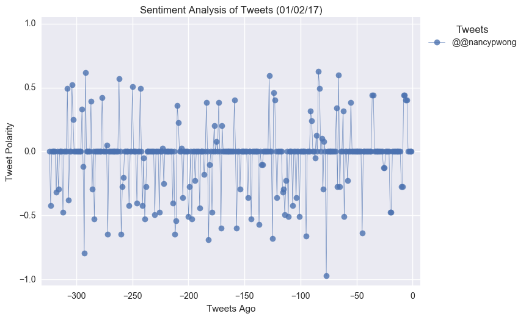

Link to code: https://github.com/Kalsoomalik/PlotBot/blob/master/PlotBot.ipynb

## PlotBot

In this activity, more challenging than the last, I built a Twitter bot that sends out visualized sentiment analysis of a Twitter account's recent tweets.

Visit <https://twitter.com/PlotBot5> for an example of what your script should do.

The bot receives tweets via mentions and in turn performs sentiment analysis on the most recent twitter account specified in the mention

For example, when a user tweets, **"@PlotBot Analyze: @CNN,"** it will trigger a sentiment analysis on the CNN twitter feed.

A plot from the sentiment analysis is then tweeted to the PlotBot5 twitter feed. See below for examples of scatter plots I generated:

Hints, requirements, and considerations:

* Bot scans your account every **five minutes** for mentions.
* Bot pulls 500 most recent tweets to analyze for each incoming request.
* Script prevents abuse by analyzing **only** Twitter accounts that have not previously been analyzed.
* Plot includes meaningful legend and labels.
* It also mentions the Twitter account name of the requesting user.
* There are at least **three** analyses tweeted out from your account.
* Notable libraries used to complete this application include: Matplotlib, Pandas, Tweepy, and VADER.
* You may find it helpful to organize your code in function(s), then call them.
* If you're not yet familiar with creating functions in Python, here is a tutorial you may wish to consult: <https://www.tutorialspoint.com/python/python_functions.htm>.

## Copyright

Data Boot Camp © 2018. All Rights Reserved.
